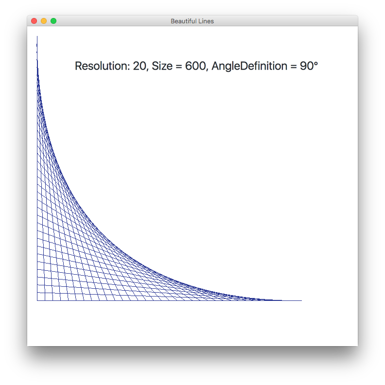
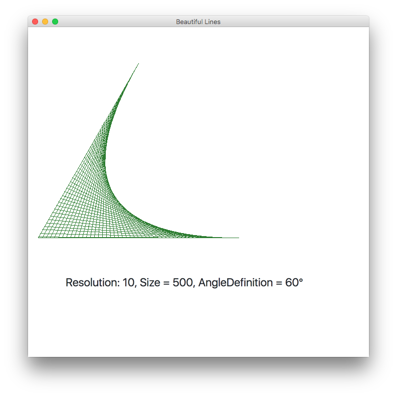
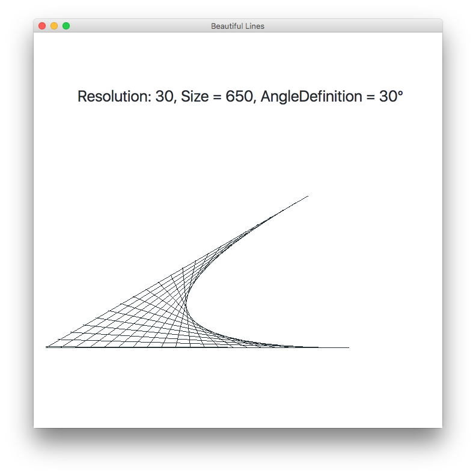
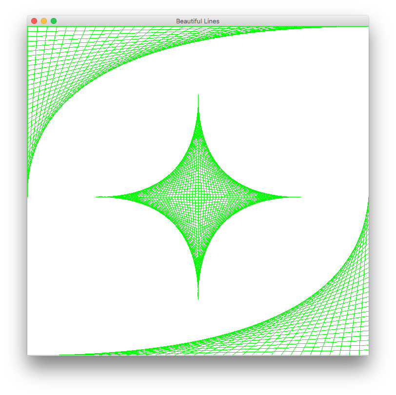
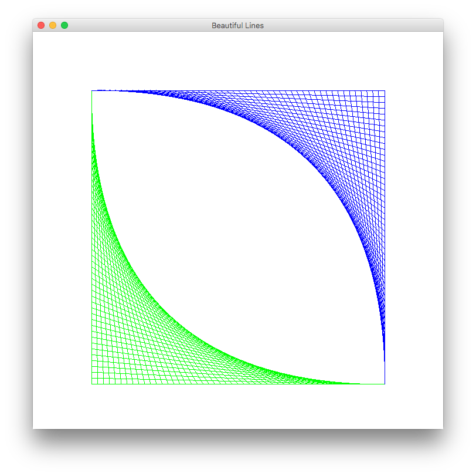
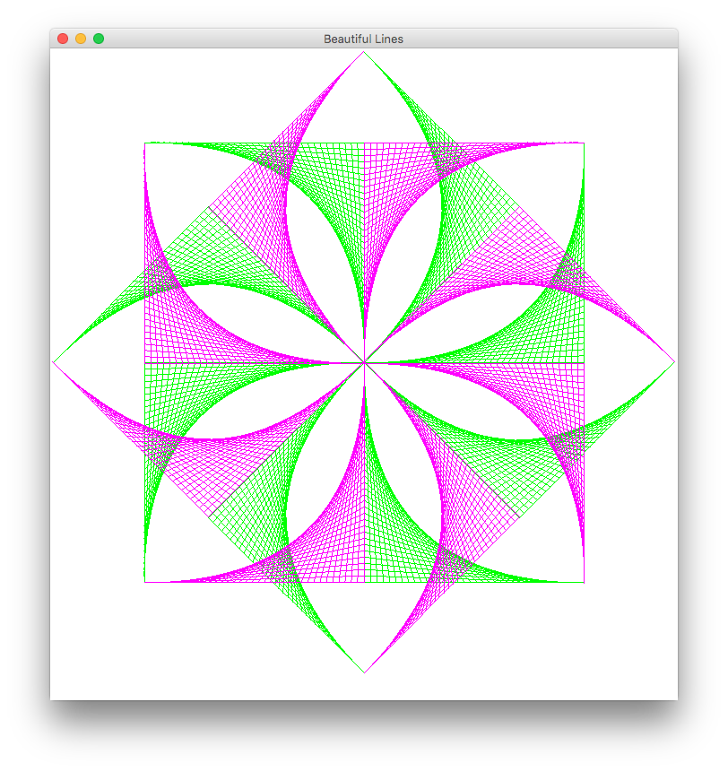
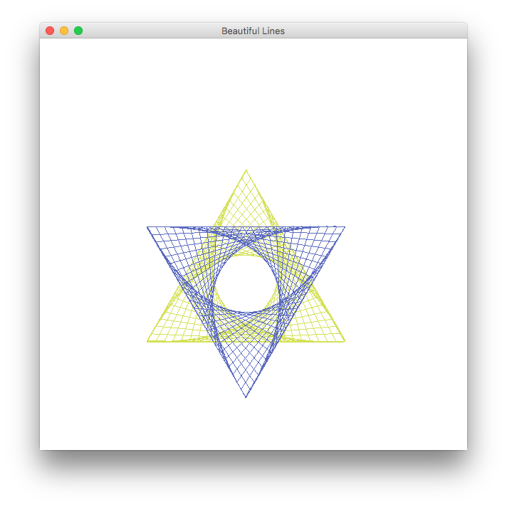

#  Art with Lines


## DrawBezierCurve Function

If you want to create a generic Bezier Curve, just call
```java
public void DrawBezierCurve(Graphics g, int Size, int Resolution, double AngleDefinition) {
    int Final = ((int) Size / Resolution) * Resolution;
    int Start = 0;

    int UpBound   = (int) ((1 - Math.sin(AngleDefinition)) * Final);
    int LeftBound = (int) ((Math.cos(AngleDefinition)) * Final);

    for (int step = Start; step <= Final; step += Resolution) {
        int MoveX = LeftBound - (int)(step * Math.cos(AngleDefinition));
        int MoveY = UpBound   + (int)(step * Math.sin(AngleDefinition));
        g.drawLine(step, Final, MoveX, MoveY);
    }

    g.drawLine(0, Final, Final, Final);
    g.drawLine(0, Final, LeftBound, UpBound);
}
``` 

Remember:
	- **Size** Is the size to the square to contain your curve
	- **Resolution** Is the size of the step, smaller equals sharper
	- **AngleDefinition** Is the angle (in radians) of the curve

Let's see an example:
<center>	
	
</center>

<center>	
	
</center>

<center>	
	
</center>


## Art with Lines (Bad Examples)
<center>	
	
	
	
    
    
	
</center>

